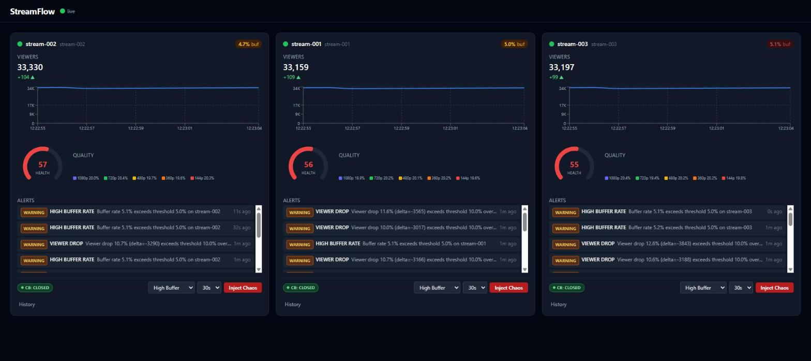
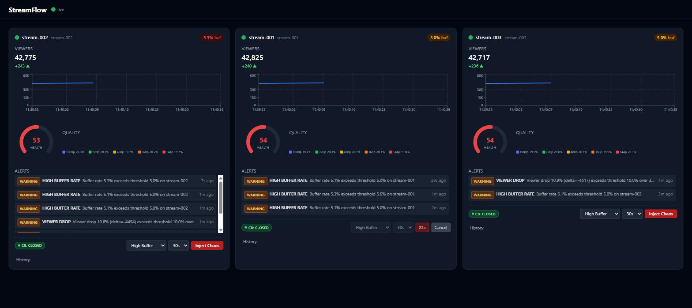
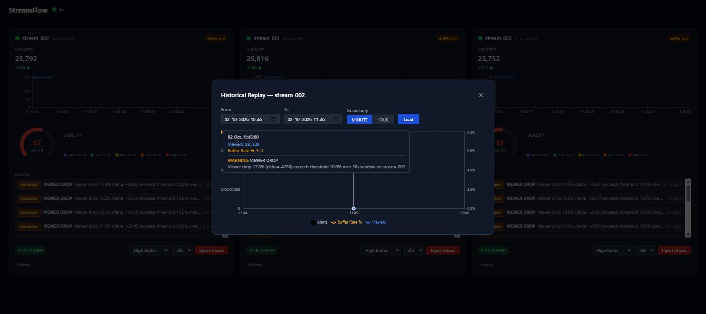
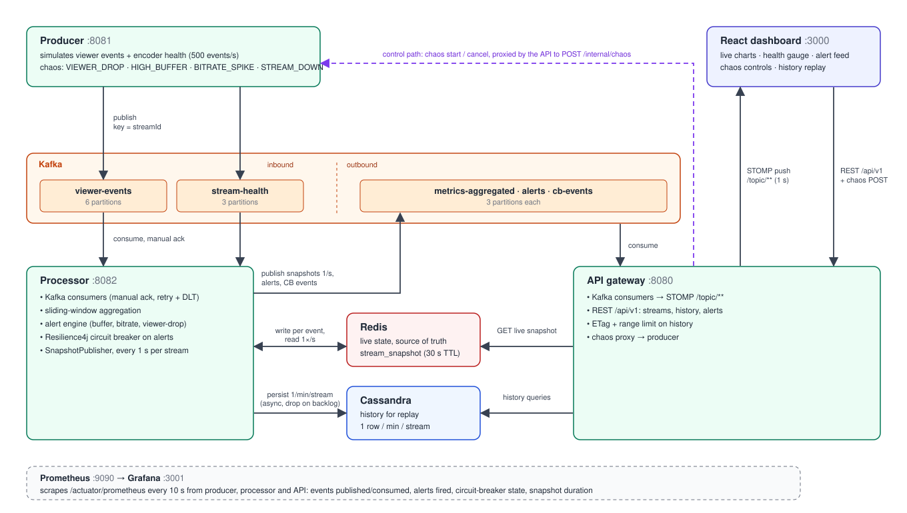

# StreamFlow

Real-time live streaming analytics dashboard: Kafka → Spring Boot → Redis/Cassandra → React (WebSocket).

[](https://github.com/gauravdubey110/streamflow/actions/workflows/ci.yml)
[](LICENSE)

---

## Screenshots

**Live dashboard** — one card per stream: viewer count and trend chart, health gauge, quality
distribution, alert feed, circuit-breaker state, and chaos controls, updated every second over
WebSocket.



**Chaos injection** — injecting a scenario (here `High Buffer` for 30 s on `stream-001`) shows a
countdown with a Cancel button; the resulting alerts stream into the feed.



**Historical replay** — the History modal replays persisted per-minute metrics from Cassandra with
alert markers and a tooltip.



---

## Architecture



How the pieces fit:

- **Data plane (solid arrows):** the producer publishes events keyed by `streamId`; the processor
  consumes them, aggregates sliding windows in Redis, and once a second per stream publishes a
  snapshot (plus alerts and circuit-breaker transitions) back to Kafka. The API consumes those
  topics and pushes them to the dashboard over STOMP — the WebSocket feed is Kafka-driven, not
  polled from Redis.
- **Two read paths:** live values come from Redis (`stream_snapshot`, 30 s TTL); history comes
  from Cassandra, which is written only once per minute per stream and is used for replay, not
  for live state.
- **Control plane (dashed arrow):** chaos requests go dashboard → API → producer's internal REST
  endpoint, the reverse direction of the data flow.
- **Throughput limit:** because events are keyed by `streamId`, each stream's events share one
  partition (with three streams, only one or two consumer threads do real work), and the processor
  measured about 900 events/s on a dev machine. The default simulation rate is
  therefore 500 events/s (`STREAMFLOW_SIMULATION_TPS`); higher rates make consumer lag grow.

| Service | Port | Role |
|---|---|---|
| `streamflow-producer` | 8081 | Simulates viewer/health events (500/s by default); chaos injection |
| `streamflow-processor` | 8082 | Kafka consumer; Redis aggregation; Resilience4j CB |
| `streamflow-api` | 8080 | REST API + STOMP WebSocket gateway |
| Frontend (Nginx) | 3000 | React live dashboard |
| Prometheus | 9090 | Metrics scraping |
| Grafana | 3001 | Pre-provisioned dashboard (admin/admin) |

---

## Quick start — infrastructure only (dev)

```bash
# Start Kafka, Redis, Cassandra, Prometheus, Grafana
docker compose -f infra/docker-compose.dev.yml up -d

# Create Kafka topics
./infra/kafka/init-topics.sh
```

Then run each service locally:

```bash
# Terminal 1
mvn -f backend/streamflow-producer/pom.xml spring-boot:run

# Terminal 2
mvn -f backend/streamflow-processor/pom.xml spring-boot:run

# Terminal 3
mvn -f backend/streamflow-api/pom.xml spring-boot:run

# Terminal 4
cd frontend && npm install && npm run dev
# Open http://localhost:5173
```

---

## Full-stack (single command)

```bash
docker compose up --build
# Dashboard: http://localhost:3000
# Grafana:   http://localhost:3001  (admin / admin)
```

Startup order is enforced via healthchecks and `depends_on` conditions — no manual waiting required.

To tear down and remove volumes:

```bash
docker compose down -v
```

---

## Running tests

```bash
# Backend (JUnit 5 + Testcontainers)
mvn -f backend/pom.xml verify

# Frontend (Vitest + React Testing Library)
cd frontend && npm test

# Backend code format check (Spotless / Google Java Format)
mvn -f backend/pom.xml spotless:check
```

---

## Pre-commit hooks (optional)

**Backend:** `mvn spotless:apply` auto-formats Java source with Google Java Format.

**Frontend:** Husky + lint-staged runs ESLint + Prettier on staged files.

```bash
# Install husky (one-time, from frontend/ directory)
cd frontend
npm install --save-dev husky lint-staged
npx husky install
```

---

## Environment variables

All connection strings default to `localhost` for local development and accept overrides for Docker/Kubernetes:

| Variable | Default | Used by |
|---|---|---|
| `KAFKA_BOOTSTRAP_SERVERS` | `localhost:9092` | producer, processor, api |
| `REDIS_HOST` | `localhost` | processor, api |
| `REDIS_PORT` | `6379` | processor, api |
| `CASSANDRA_CONTACT_POINTS` | `localhost` | processor, api |
| `CASSANDRA_PORT` | `9042` | processor, api |
| `STREAMFLOW_SIMULATION_TPS` | `1000` | producer |
| `STREAMFLOW_PRODUCER_BASE_URL` | `http://localhost:8081` | api (chaos proxy) |
